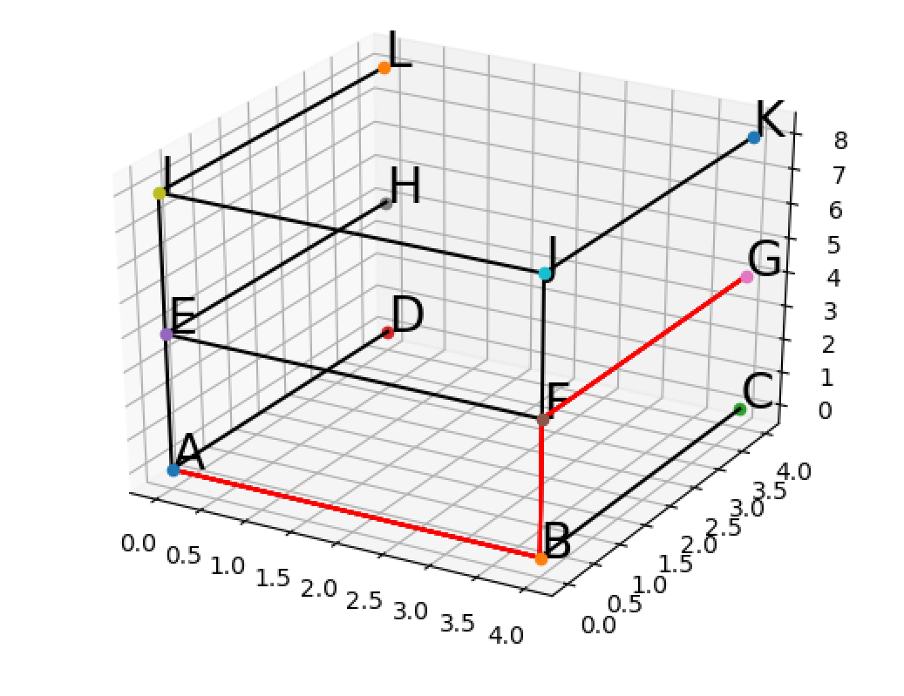

# Topological-Visualization-CDM
Visualization tool for shortest path between two nodes in a 3D graph.

Based on the combinatorial data model for visualization the internal topology of buildings, where vertices represent rooms, and edges represent the connections between rooms (hallways, stairwells, etc.)

Current working model supports the following:
* Takes in a set of vertices and edges as parameters
* Prompts the user for start vertex and end vertex
* Calculates the shortest path between the start and end vertices
* Displays the shortest path on a graph in red, with other connections displayed in black.

## Example Output
Given the input in `input.txt`, the following graph will be plotted.


Where the red lines show the path from A to G, and the black lines show unused connections.

### Input Format
The input is expected to follow the exact format in input.txt, where the file first contains a list of vertices, formatted as:
`<name> <x-coordinate> <y-coordinate> <z-coordinate>`
Where each element is separated by a space, and name is limited to one character.

Then, a single line stating `Connections:`

And following will be the edge connections, denoted by `<1st vertex name><2nd vertex name>` with no separation.  Each edge will be on a new line.

A simple example:
```
A 1 2 3
X 9 8 7
Connections:
AX
```

The given graph must be a valid simple, connected graph, where no coordinate value exceeds 10.
